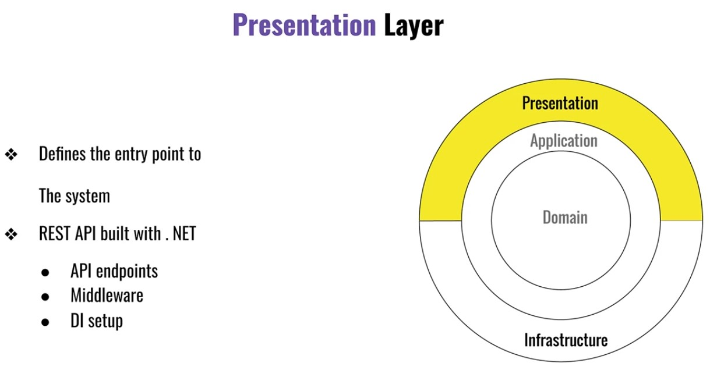

# Clean Architecture y Domain Driven Design en ASP.NET Core 8

**ASP.NET Core 8 con Clean Architecture Profesional | Dapper | Entity Framework | Principios Solid | Domain Driven Design**

Las mejores practicas en base a la experiencia de programadores profesionales de asp.net core que trabajan con los mejores paradigmas y patrones de diseno, para crear aplicaciones .net robustas y escalables en diversas empresas de USA y Mexico.

Estos seran algunos temas que veremos:
- Domain Driven Design aplicado al 100 por ciento con entities y object values en tu proyecto Net 8.
- Clean Architecture , el que de verdad se utiliza en proyectos escalables y no demos CRUD.
- Patron de Architecture CQRS y MediatR, implementado con clases Generic - como nunca antes visto.
- Aprende que son los Cros Cutting Concerns.
- Dapper a nivel avanzado para consultas integrado con Entity Framework.
- Concurrencia de multiprocesos en NET.
- Middleware avanzado para Validations erros y pipelines.

## Como desarrollar software a gran escala?

- Son llamados Domain Experts
- Conocen a la perfección el negocio
- No conocen de tecnología o programacion
- Responsables de definir reglas de negocio
- Si es un simple CRUD no hay problema
- Cuando son muchas reglas de negocio es difícil modelar
- Qué hacer cuando tenemos un projecto de gran escala?

**La Terminologia de DDD**

Entity:
- Entity Framework Core: Es una clase de tipo data model, que tiene como objetivo mapearse contra una tabla en una db.
- Domain-Driven Design: Una clase de tipo dominio con una identidad para tracking.

Context:
- Entity Framework Core: Una clase DbContext tiene acceso a las entidades del negocio y define el mapeo de cada entidad contra la db.
- Domain-Driven Design: Un Bounded Context define el ambiente y los limites de un conjunto de entidades de dominio.
  

## Principios de Arquitectura

## Docker

## Testing

